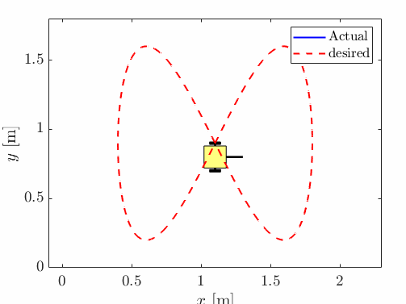
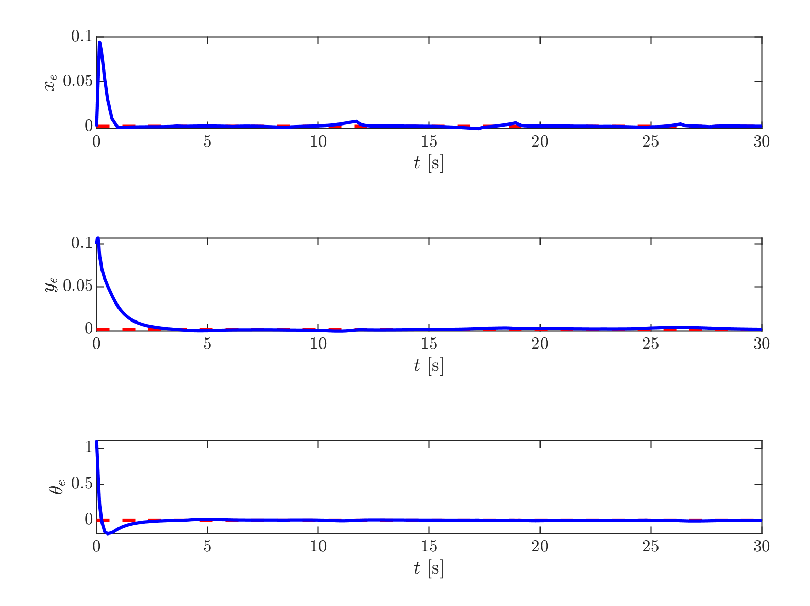
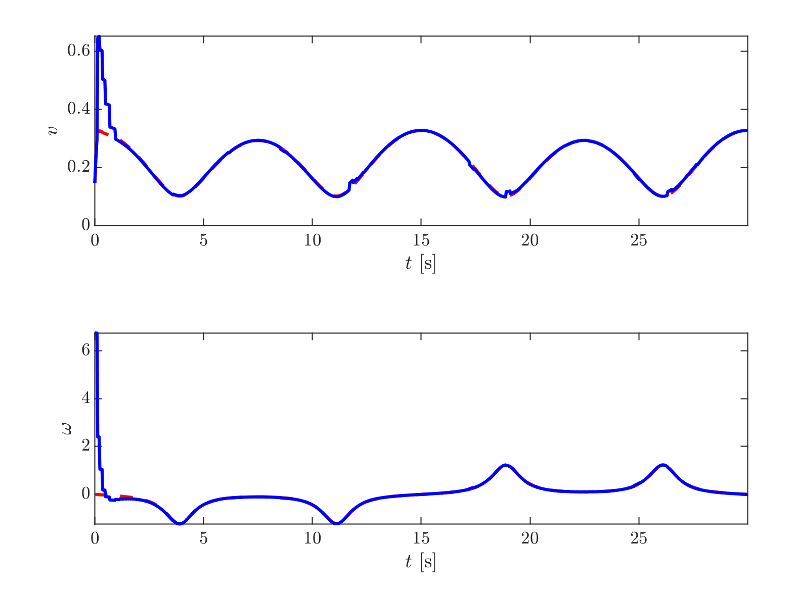
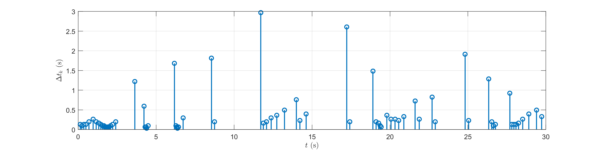
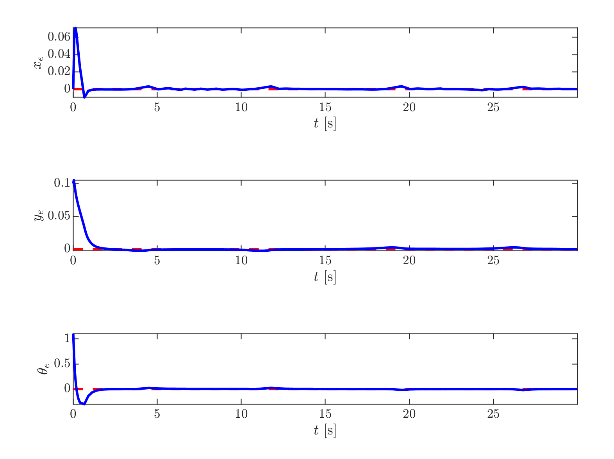
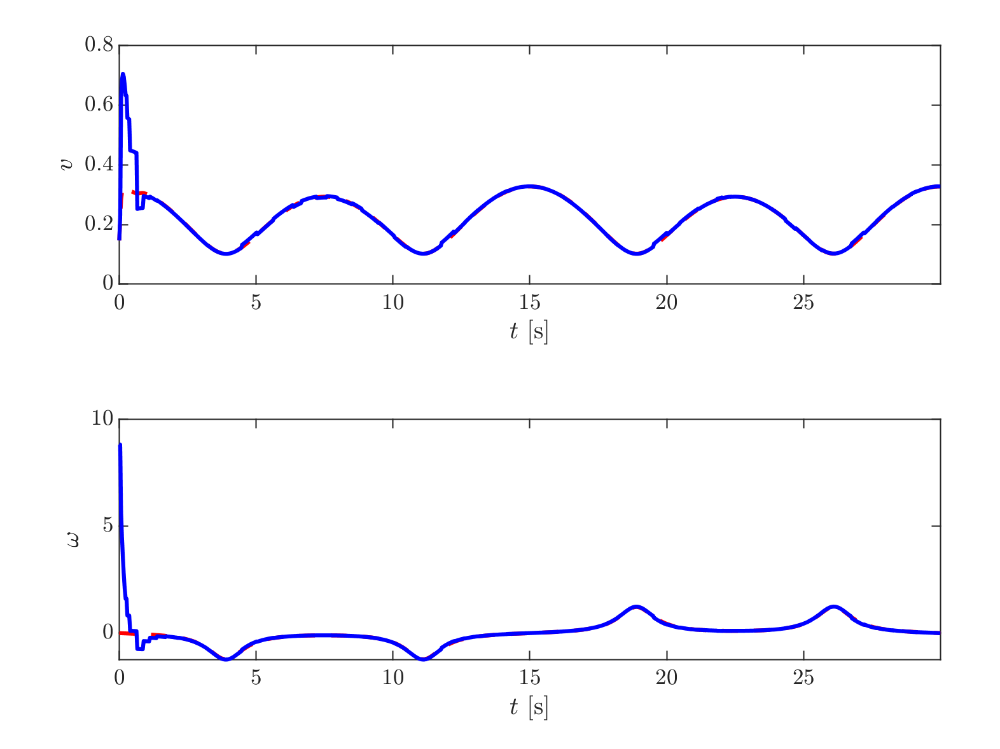
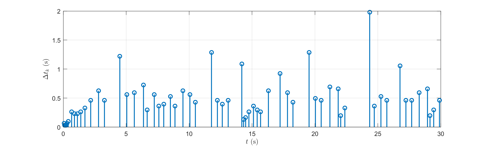

# Event-Triggered Trajectory Tracking Control of a Wheeled Mobile Robot (Linear Model)

## Overview

This repository contains MATLAB simulations for trajectory tracking
control of a wheeled mobile robot based on a linearized kinematic model.

Two different event-triggered control strategies are implemented and
compared:

1.  EDSMC -- Event-Driven Sliding Mode Control\
2.  ELSFC -- Event-Driven Linear State Feedback Control

The goal is to achieve accurate trajectory tracking while reducing
unnecessary control updates using event-triggering mechanisms.

------------------------------------------------------------------------

## System Description

The wheeled mobile robot is modeled using a linearized state-space
representation around a nominal operating point.

Control objectives:

-   Track a predefined reference trajectory
-   Minimize tracking errors
-   Reduce control update frequency
-   Preserve closed-loop stability

Both controllers are implemented in discrete time.

------------------------------------------------------------------------

## Repository Structure

    .
    ├── EDSMC.m
    ├── ELSFC.m
    ├── common/
    │
    ├── EDSMC_errors.png
    ├── EDSMC_inputs.png
    ├── EDSMC_events.png
    ├── EDSMC_gif.gif
    │
    ├── ELSFC_errors.png
    ├── ELSFC_inputs.png
    ├── ELSFC_events.png
    ├── ELSFC_gif.gif

-   `EDSMC.m` -- Simulation using event-driven sliding mode control\
-   `ELSFC.m` -- Simulation using event-driven linear state feedback\
-   `common/` -- Shared parameters and auxiliary functions

------------------------------------------------------------------------

# Simulation Results

------------------------------------------------------------------------

## 1. Event-Driven Sliding Mode Control (EDSMC)

### Trajectory Animation



### Tracking Errors



### Control Inputs



### Triggering Events




------------------------------------------------------------------------

## 2. Event-Driven Linear State Feedback Control (ELSFC)

### Trajectory Animation


### Tracking Errors



### Control Inputs



### Triggering Events



------------------------------------------------------------------------

## Performance Discussion

-   Both controllers ensure trajectory convergence.
-   Event-triggering reduces the number of control updates compared to
    periodic sampling.
-   EDSMC provides improved robustness at the cost of potential
    chattering.
-   ELSFC offers smoother control inputs with simpler implementation.

------------------------------------------------------------------------

## How to Run

1.  Open MATLAB.
2.  Navigate to the repository directory.
3.  Run one of the following commands:

``` matlab
EDSMC
```

or

``` matlab
ELSFC
```

All figures and animations will be generated automatically.

------------------------------------------------------------------------

## Author

Allaeddine Damani\
PhD in Automation